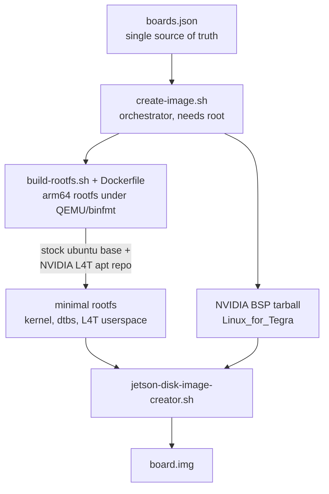

# Jetson Image Maker

[](https://github.com/aniongithub/jetson-nano-image-maker/actions/workflows/pr.yml)
[](https://github.com/aniongithub/jetson-nano-image-maker/actions/workflows/build.yml)
[](https://github.com/aniongithub/jetson-nano-image-maker/actions/workflows/release.yml)
[](./LICENSE)

> **tl;dr** Minimal, ready-to-flash Ubuntu images for NVIDIA Jetson boards, built reproducibly from a `Dockerfile` and NVIDIA's public L4T apt repositories — no interactive setup, no host-side SDK Manager.

NVIDIA's supported setup path (SDK Manager / `flash.sh`) expects a device physically attached in recovery mode and walked through interactive configuration. This project skips all of that: download an image, flash it to an SD card, and boot a clean, minimal Ubuntu that's ready to use — no host tooling, no recovery mode, no first-boot wizard. Every image is published as a release artifact, so it works just as well for a fleet or a CI pipeline as for a single board on your desk.

## Supported boards

Images for these boards are built by CI on every PR and release. The board name links to the latest ready-to-flash image:

| Board | Ubuntu | L4T | Boot device | Status |
|-------|--------|-----|-------------|--------|
| [`jetson-nano` (4GB)](https://github.com/aniongithub/jetson-nano-image-maker/releases/latest/download/jetson-nano.img.xz) | 20.04 | r32.6 (t210) | SD | ✅ CI + hardware-verified |
| [`jetson-nano-2gb`](https://github.com/aniongithub/jetson-nano-image-maker/releases/latest/download/jetson-nano-2gb.img.xz) | 20.04 | r32.6 (t210) | SD | ✅ CI built |
| [`jetson-orin-nano`](https://github.com/aniongithub/jetson-nano-image-maker/releases/latest/download/jetson-orin-nano.img.xz) | 22.04 | r36.4 (t234) | SD | ✅ CI + hardware-verified |

The following boards are **defined in [`boards.json`](./boards.json) but not yet wired for a bootable build** (no `l4t_apt` block, so the rootfs is produced without an NVIDIA kernel). They're a starting point for contributions, not ready-to-flash targets:

| Board | Status |
|-------|--------|
| `jetson-agx-orin` | 🧪 experimental / not built by CI |
| `jetson-agx-xavier` | 🧪 experimental / not built by CI |
| `jetson-xavier-nx` | 🧪 experimental / not built by CI |

## Download & flash

1. Grab the latest image for your board from the [**Releases**](https://github.com/aniongithub/jetson-nano-image-maker/releases/latest) page (e.g. `jetson-orin-nano.img.xz`).
2. Flash it to an SD card with [Balena Etcher](https://www.balena.io/etcher) or [Raspberry Pi Imager](https://www.raspberrypi.com/software/). Both handle the `.xz` decompression for you.
3. Insert the card and power on the board.

Default credentials:

| | |
|---|---|
| username | `jetson` |
| password | `jetson` |

The root filesystem auto-expands to fill the card on first boot.

## How it works



- **[`boards.json`](./boards.json)** describes every board: default Ubuntu release, L4T major, boot device, disk-image IDs, the L4T apt coordinates (`l4t_apt`), optional `features` (e.g. the container runtime), and the BSP tarball URL. It is the single source of truth read by all the scripts.
- **[`build-rootfs.sh`](./build-rootfs.sh)** + **[`Dockerfile`](./Dockerfile)** build the arm64 root filesystem in a container using `qemu-user-static`/binfmt. The Dockerfile generates the NVIDIA L4T apt source from the `l4t_apt` coordinates and installs the L4T kernel, device trees, and userspace packages.
- **[`create-image.sh`](./create-image.sh)** ties it together: it resolves the board's parameters, ensures the rootfs is built (cached under `/var/cache/jetson-rootfs`), downloads the matching NVIDIA BSP, populates `Linux_for_Tegra/rootfs`, and runs NVIDIA's `jetson-disk-image-creator.sh` to produce the final `.img`.

> **L4T r36 note:** the `nvidia-l4t-initrd` package registers a dpkg trigger (`nv-update-initrd`) that needs a BSP-only LUKS helper absent from the apt repo. For these unencrypted images the Dockerfile temporarily `dpkg-divert`s that binary to a no-op during install and restores it afterward, using the prebuilt `/boot/initrd` the package already ships. This is a no-op on r32 (Nano).

## Docker & GPU containers

The bootable images ship with **Docker** and the **NVIDIA container runtime** preinstalled and configured, so GPU-accelerated containers work out of the box — no manual `nvidia-container-toolkit` setup:

- Docker's `default-runtime` is set to `nvidia`, so `docker build` and `docker run` see the GPU by default (matching NVIDIA's own Jetson images).
- The `jetson` user is in the `docker` group, so no `sudo` is needed.
- The correct per-era packages are used automatically: `docker.io` + `nvidia-container-toolkit` (+ `nvidia-container-runtime` on L4T r32), all from apt sources the image already trusts.

This is controlled by the per-board `features.container_runtime` flag in [`boards.json`](./boards.json) (defaults **on** for the three bootable boards). To build a lean image without it, either flip that flag to `false` or pass `--no-container-runtime` to `create-image.sh`.

## Building locally

You need Linux with Docker, `qemu-user-static`, and `jq`. The image assembly step needs root.

```bash
sudo apt-get install -y jq qemu-user-static libxml2-utils xmlstarlet

# Build the default image for a board
sudo ./create-image.sh -b jetson-orin-nano

# Override defaults as needed
sudo ./create-image.sh -b jetson-orin-nano -d SD -l 36 -u 22.04
```

The result is `<board>.img` in the current directory. Compress it with `xz -9 -T0 <board>.img` if you want a release-sized artifact.

### `create-image.sh` flags

| Flag | Meaning | Default |
|------|---------|---------|
| `-b, --board` | Board name (required) | — |
| `-l, --l4t` | L4T major (e.g. `32`, `35`, `36`) | newest compatible for the Ubuntu base |
| `-r, --revision` | L4T revision override | board default |
| `-d, --device` | Boot device: `SD`, `USB`, or `EMMC` | per-board default |
| `-u, --ubuntu` | Ubuntu base release (e.g. `20.04`, `22.04`) | per-board default |
| `-o, --outdir` | Output directory for the image | `.` |
| `--bsp` | Override the NVIDIA BSP tarball URL | from `boards.json` |
| `--no-container-runtime` | Skip Docker + NVIDIA container runtime for a minimal image | container runtime on (per `boards.json`) |

Rootfs builds are cached per Ubuntu + L4T combination at `/var/cache/jetson-rootfs/rootfs-<ubuntu>-l4t<l4t>` (with a `-docker` suffix when the container runtime is included). Export `JETSON_ROOTFS_DIR` to point at your own.

## Continuous integration

Three workflows drive the project:

| Workflow | Trigger | What it does |
|----------|---------|--------------|
| [**PR Validation**](./.github/workflows/pr.yml) | pull request | Validates `boards.json`, shellchecks/syntax-checks the scripts, then builds all three supported boards. |
| [**Manual Image Build**](./.github/workflows/build.yml) | `workflow_dispatch` | Builds one board or all three on demand, optionally compresses, and uploads the image as an artifact (7-day retention). |
| [**Release Build**](./.github/workflows/release.yml) | release published | Builds and `xz`-compresses all three boards and attaches the images to the GitHub Release. |

To build an image without cutting a release, open **Actions → Manual Image Build → Run workflow**, pick a board (or `all`), and download the artifact when it finishes.

## Adding or fixing a board

Boards are data, not code. To wire up a new board (or fix an existing one):

1. Add/adjust the board entry in [`boards.json`](./boards.json). The important fields:
   - `default_ubuntu`, `default_device`, `requires_device`
   - `disk_ids` — maps L4T major → the disk-image ID passed to `jetson-disk-image-creator.sh`
   - `l4t_apt` — `{ soc, release, needs_bionic }` per L4T major. **This is what makes a build bootable**; without it the rootfs has no NVIDIA kernel.
   - `features` — optional per-board toggles, e.g. `{ "container_runtime": true }` to bake in Docker + the NVIDIA container runtime (defaults on for bootable boards)
   - `bsp` — the NVIDIA BSP tarball URL per L4T major
2. Build locally (`sudo ./create-image.sh -b <board>`) and, ideally, verify on real hardware.
3. Add the board to the CI matrices in the workflows if it should be built automatically.

## Troubleshooting

### Orin Nano boots the wrong OS / doesn't boot from SD

On JetPack 6 the UEFI boot order is `usb, nvme, emmc, sd, ufs`, so a populated NVMe drive boots *before* the SD card. To confirm what you actually booted from:

```bash
findmnt /                   # SD boot shows /dev/mmcblk1p1
cat /etc/nv_tegra_release   # L4T release baked into the rootfs
```

If you want SD to win, remove/blank the NVMe drive or adjust the UEFI boot order.

### Orin Nano: the image doesn't boot at all

The Orin's bootloader/UEFI lives in the module's QSPI, not on the SD card. The QSPI firmware must be the **same L4T major** as the image (these images are L4T r36). Check the installed version with `cat /sys/devices/virtual/dmi/id/bios_version` — an r36 board reports something like `36.x`. If your module still has r35 firmware, flash the r36 QSPI/UEFI once via SDK Manager before the r36 SD image will boot.

### Nano (r32) kernel panic on boot

This was a real bug in older builds where the L4T packages weren't installed into the rootfs. It's fixed — make sure you're on a current release image, not an old `0.5`-era artifact.

## Credits

Built on the excellent prior work of:

- [pythops/jetson-nano-image](https://github.com/pythops/jetson-nano-image)
- [defunctzombie/jetson-nano-image-maker](https://github.com/defunctzombie/jetson-nano-image-maker)

### References

- [NVIDIA Linux for Tegra](https://developer.nvidia.com/embedded/linux-tegra)
- [L4T Development Guide](https://docs.nvidia.com/jetson/l4t/index.html)
- [L4T public apt repo](https://repo.download.nvidia.com/jetson/)

## License

[MIT](./LICENSE)
